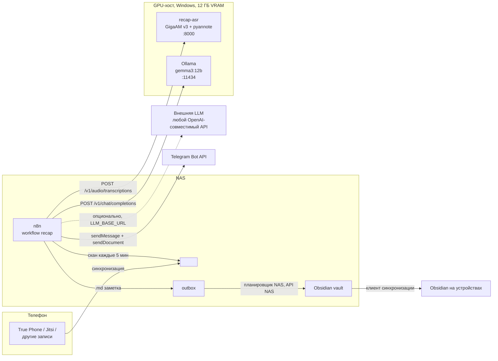

# Recap — транскрибация и суммаризация аудиозаписей

Статус: реализовано, работает в эксплуатации.
Документ описывает конечное состояние системы, а не план.
Архив записей (169 файлов) перегнан на этой версии полностью.

## 1. Цель

Автоматический конвейер без ручных действий:

1. Аудиозапись появляется на NAS в каталоге `<recordings>/<Подкаталог>/`.
   Подкаталог задаёт тип записи (звонок, встреча, голосовая заметка).
2. Транскрибация с разделением на говорящих на домашнем GPU-хосте (Windows, одна видеокарта 12 ГБ VRAM).
3. Суммаризация локальной LLM. Провайдер заменяем на любой OpenAI-совместимый.
4. Заметка в Obsidian vault: summary, действия, участники, полный транскрипт.
5. Сообщение в Telegram: summary текстом, транскрипт вложением.
   Сценарий: на телефоне попросить ассистента создать событие или задачу по тексту summary.

Все записи на русском языке. Промпты и заметки тоже на русском.

## 2. Входные данные

- Записи звонков делает приложение True Phone на телефоне, файлы `.m4a` (AAC, низкий битрейт), от секунд до ~30 минут.
- На NAS файлы попадают клиентом синхронизации или вручную. Файлы не перемещаются и не переименовываются: обработанное учитывается в реестре.
- Формат имени True Phone:

```
+7 912 345-67-89 (Город, Область) 2026-08-19_121656_out.m4a
Иван Петров (+7 912 345-67-89 Мобильный) 2026-07-20_124612_inc.m4a
1000 @ 2026-07-29_104000_out.m4a          <- внутренний номер АТС
                              суффикс направления: _out / _inc
```

- Время в имени файла — локальное время телефона. Это авторитетный источник даты и времени, mtime может отличаться.
- Записи встреч из Jitsi: `.webm` с UTC-таймштампом в имени (`..._2026-09-01T08_24_55.582Z.webm`). Таймштамп авторитетнее mtime, конвертируется в локальное время.
- Служебные и скрытые файлы (`rr.truephone_backup` и подобные) не обрабатываются: отбор только по расширению.

## 3. Архитектура



Разделение ролей:

| Роль | Где | Что |
|---|---|---|
| Оркестратор | NAS, docker-стек `n8n` | n8n: скан каталога, реестр, вызовы API, заметки, Telegram, ретраи |
| ASR + диаризация | GPU-хост, нативная Windows-служба | `recap-asr`: GigaAM v3 + pyannote, идентификация владельца по эталону голоса, OpenAI-совместимый API |
| Суммаризация | GPU-хост (дефолт) или внешний провайдер | OpenAI-совместимый `/v1/chat/completions`; локально Ollama, провайдер меняется env-переменными |
| Доставка заметок | NAS, планировщик | outbox -> штатный API NAS -> vault -> клиент синхронизации разносит по устройствам |
| Уведомления | Telegram | отдельный бот, личный чат |

### 3.1 Почему n8n

- **dify** — платформа LLM-приложений (чаты, RAG, агенты). Файловых триггеров и обхода каталогов нет, бинарные файлы не его модель. Пришлось бы писать внешний watcher, dify остался бы промпт-раннером.
- **Свой Python-демон** — минимум движущихся частей, но каждая правка = код + пересборка, наблюдаемости нет. Остаётся запасным вариантом.
- **Готовые комбайны** (Scriberr и подобные) — транскрипция + summary есть, но Obsidian, Telegram и типы записей всё равно пришлось бы доклеивать.
- **n8n** — cron-триггер, Code-ноды (JS), HTTP, Telegram-нода, error workflow, история экзекьюшенов для отладки. Стек общий: движок пригоден для других автоматизаций, recap — первый workflow в нём.

### 3.2 Бюджет VRAM

Одна видеокарта на 12 ГБ делится между ASR, диаризацией и LLM. Вместе они не помещаются, поэтому:

- пайплайн строго последовательный: ASR -> LLM, один файл за раз;
- `recap-asr` выгружает модели из VRAM после каждого запроса (`RECAP_UNLOAD_AFTER=1`) и по простою (`RECAP_TTL=300`);
- у Ollama штатный `keep_alive`.

## 4. Компоненты

### 4.1 Сервис транскрибации `recap-asr`

Нативная Windows-служба (Python 3.12 venv + FastAPI, WinSW), без Docker.
Код в каталоге `recap-asr/`.

**Движок ASR — GigaAM v3** (`v3_e2e_rnnt`, MIT): русский язык, пунктуация и пословные таймкоды из коробки.
Выбран по A/B на реальных звонках против whisper large-v3: точнее на русской телефонной речи и в 5–8 раз быстрее (звонок 18.7 мин — за ~45 с).
Второго движка и фолбека нет. Декод любых контейнеров (m4a, webm, mp4, mp3) — PyAV.

**Диаризация** — pyannote `speaker-diarization-3.1` (gated-модель на Hugging Face, нужен токен и принятые условия).
Диаризация выполняется ПЕРВОЙ и служит VAD: транскрибируются только речевые интервалы, музыка ожидания и тишина в ASR не попадают.
Для звонков подсказка `num_speakers=2`, для остальных типов без фиксированного числа.

**Чанкер.** У GigaAM short-form лимит ~25 с, а штатный `transcribe_longform` на Windows не работает (HFValidationError на локальном пути с бэкслешами).
Поэтому речевые интервалы режутся на куски <= 23.5 с по самым тихим местам (поиск начиная с 16 с).
Пословные таймкоды сдвигаются на начало куска.

**Реплики.** Кусок с одним спикером остаётся целым. Кусок, где спикеры перемешаны (перебивания), делится по словам по перекрытию с интервалами диаризации.
Соседние реплики одного спикера сливаются при паузе < 1.2 с. Реплики из одной пунктуации отбрасываются.

**Идентификация владельца.** Эталон голоса `owner_ref.npy` строится один раз скриптом `enroll.py` из 2–3 исходящих звонков разным контактам: спикер, чей голосовой отпечаток повторяется во всех звонках, и есть владелец.
Эмбеддинги — `pyannote/wespeaker-voxceleb-resnet34-LM`, сравнение косинусной близостью, порог `RECAP_OWNER_THRESHOLD=0.5`.
На реальных данных владелец даёт 0.69–0.91, остальные 0.03–0.19, разрыв явный.
В ответе у каждого спикера `is_owner` и `owner_score`.

**Короткие записи.** Файлы короче `RECAP_MIN_DURATION` (5 с) не транскрибируются: ответ `{"segments": [], "skipped": "too_short"}`, workflow ставит статус `skipped`.

**API.** `POST /v1/audio/transcriptions` (multipart, OpenAI-совместимый):

| Поле | Дефолт | Смысл |
|---|---|---|
| `file` | — | аудио или видео (m4a/mp3/wav/webm/…, декодирует PyAV) |
| `language` | `ru` | GigaAM только русский |
| `diarize` | `true` | `false` — без диаризации |
| `num_speakers` | — | подсказка диаризации |

Ответ: `{text, language, duration, segments[{start, end, text, speaker}], speakers[{label, is_owner, owner_score, talk_time}], diarization, processing_time}`.
Ошибка диаризации не валит транскрипцию: `diarization: false` + `diarization_error`.
Нечитаемый файл — HTTP 422, workflow помечает его `failed` без повторов.
`GET /health` — движок, загруженность моделей, наличие эталона.

**Конфигурация службы (env):**

| Переменная | Дефолт | Смысл |
|---|---|---|
| `RECAP_MODEL` | `v3_e2e_rnnt` | модель GigaAM |
| `RECAP_GIGAAM_CACHE` | `gigaam-cache/` рядом с кодом | кэш весов GigaAM (дефолтный `~/.cache` у службы LocalSystem уезжает в systemprofile) |
| `HF_HOME`, `HF_TOKEN` | — | кэш и токен Hugging Face для pyannote |
| `RECAP_OWNER_REF` | `owner_ref.npy` рядом с кодом | эталон голоса |
| `RECAP_OWNER_THRESHOLD` | `0.5` | порог is_owner |
| `RECAP_MIN_DURATION` | `5` | секунды, короче — skipped |
| `RECAP_TTL`, `RECAP_UNLOAD_AFTER` | `300`, `1` | выгрузка моделей из VRAM |
| `RECAP_FFMPEG_DIR` | `bin/` рядом с кодом | каталог с `ffmpeg.exe` (gigaam зовёт его по имени даже для wav) |
| `RECAP_HOST`, `RECAP_PORT` | `0.0.0.0`, `8000` | адрес службы |

Аутентификации в сервисе нет: порт открывается firewall только для локальной сети.
Служба Automatic, после перезагрузки поднимается сама.

**Грабли нативной установки на Windows** (подробно в `recap-asr/README.md`):

- `torch`/`torchaudio` 2.8.0 (cu128), не новее: 2.9 ломает pyannote 3.3.2; `huggingface_hub<1.0`; `matplotlib` обязателен.
- torch >= 2.6 не грузит чекпоинты pyannote из-за `weights_only` — служба выставляет `TORCH_FORCE_NO_WEIGHTS_ONLY_LOAD=1`.
- Reparse-каталог WinGet Links в PATH роняет любой скан PATH ошибкой 448 — вычищается из PATH процесса.
- GigaAM ставится из zip-архива репозитория, если на хосте нет git.

### 4.2 LLM суммаризации

Единый OpenAI-совместимый интерфейс `{LLM_BASE_URL}/chat/completions`. Провайдер задаётся env стека, workflow от провайдера не зависит:

| Переменная | Дефолт | Смысл |
|---|---|---|
| `LLM_BASE_URL` | `http://<gpu-host>:11434/v1` | база API (Ollama локально) |
| `LLM_API_KEY` | пусто | ключ провайдера, для Ollama не нужен |
| `LLM_MODEL` | `gemma3-recap` | имя модели у провайдера |
| `LLM_PROXY` | пусто | HTTP-прокси до провайдера, если он недоступен напрямую |

- **Дефолт локально**, записи наружу не уходят. Модель `gemma3-recap` — производная от `gemma3:12b` (`llm/Modelfile`: `num_ctx 16384`, `temperature 0.2`). Производная нужна потому, что OpenAI-совместимый endpoint Ollama игнорирует `options.num_ctx`, а дефолтного контекста на длинные записи не хватает.
- **A/B саммари** на одинаковых транскриптах: `gemma3:12b` против `qwen3:14b`, `qwen3:30b-a3b`, `gpt-oss:20b`. gemma3 точнее держит роли говорящих и не домысливает; gpt-oss быстрее, но хуже. Оставлен gemma3.
- Любой внешний провайдер с OpenAI-совместимым API (OpenAI, OpenRouter, DeepSeek, Gemini через `/v1beta/openai/`, совместимые слои других вендоров) — правка env без изменения workflow.
- JSON запрашивается промптом, structured output провайдеров не используется (есть не у всех). Парсинг устойчивый: срезание код-фенсов, при невалидном JSON одна повторная попытка с более строгим промптом, затем заметка с сырым ответом. На архиве фолбек сработал в 1.3% записей.

Ожидаемая структура ответа:

```json
{
  "title": "заголовок 3-7 слов",
  "summary": "суть, 3-8 пунктов markdown-списком",
  "action_items": ["действия и договорённости, с датами если названы"],
  "participants": ["кто участвовал"]
}
```

Промпт (код в `workflow/build_prompt.js`):

- свой вводный абзац на каждый тип: звонок / встреча / голосовая заметка / generic;
- предупреждение, что транскрипт автоматический и может содержать ошибки: непонятное пропускать, не домысливать;
- нецензурная лексика — нормальные данные, в summary пересказывать нейтрально (без этого модель ломала JSON на «бытовых» записях);
- владелец назван по имени из `RECAP_OWNER_NAME`: в summary «<Имя> попросил…», в participants «<Имя> (владелец)». В транскрипте метка остаётся «Я:»;
- если собеседник сменился (телефон передали), отметить это в summary;
- транскрипт с таймкодами и метками спикеров, обрезка на 40 000 символов с пометкой в заметке.

### 4.3 Оркестратор n8n

Docker-стек `n8n` на NAS (compose в `stack/docker-compose.yml`), образ `n8nio/n8n`, SQLite.
Контейнер работает от uid:gid владельца каталогов с записями и vault, иначе запись упирается в ACL NAS.

Ключевые настройки:

| Переменная | Значение | Зачем |
|---|---|---|
| `N8N_CONCURRENCY_PRODUCTION_LIMIT` | `1` | тики строго по очереди: параллельные писали бы реестр наперегонки |
| `N8N_RESTRICT_FILE_ACCESS_TO` | `/data/recordings;/data/state;/data/vault` | нода Read/Write Files иначе не пускает к путям |
| `N8N_DEFAULT_BINARY_DATA_MODE` | `filesystem` | бинарники не в БД |
| `NODE_FUNCTION_ALLOW_BUILTIN` | `fs,path,crypto` | Code-нодам нужна ФС |
| `RECAP_ASR_URL` | `http://<gpu-host>:8000` | сервис транскрибации |
| `RECAP_BATCH` | `20` | файлов за один тик |
| `RECAP_OWNER_NAME` | имя владельца | для summary |
| `RECAP_TZ_OFFSET_HOURS` | `0` | сдвиг локального времени от UTC для дат из Jitsi и mtime |
| `RECAP_TG_MAX_AGE_DAYS` | `2` | записи старше в Telegram не шлются |
| `TELEGRAM_BOT_TOKEN`, `TELEGRAM_CHAT_ID` | секреты | доставка |

Bind mounts: каталог записей -> `/data/recordings`, каталог состояния -> `/data/state` (реестр, outbox), vault -> `/data/vault` (workflow только проверяет коллизии имён, запись идёт через outbox).

Два workflow, деплой скриптом `workflow/deploy_workflows.py` через REST API n8n (код нод лежит отдельными `.js`-файлами и подставляется в JSON workflow):

- `recap-pipeline`: Every 5 min -> Scan -> Loop -> Read audio -> ASR -> IF ASR ok -> Build prompt / Mark bad -> IF Has speech -> LLM -> Save note -> IF TG configured -> TG message -> Prep doc -> TG doc -> Finalize -> Loop.
- `recap-errors`: Error Trigger -> Format -> Telegram.

Грабля: task runner n8n не наследует `TZ` контейнера, `getHours()` в Code-нодах врёт. Локальное время считается от UTC со смещением `RECAP_TZ_OFFSET_HOURS`.

Аудио читается нативной нодой Read/Write Files, не Code-нодой: `fs.readFileSync` 80-мегабайтной записи встречи ронял Code-ноду по памяти.

### 4.4 Заметки Obsidian

- Каталог в vault: `Notes/Recordings/<YYYY>/`.
- Имя файла: `<YYYY-MM-DD HHMM> — <title от LLM>.md`, санитизация `:/\*?"<>|`, обрезка до 80 символов, при коллизии суффикс `-2`.
- Транскрипт целиком в теле заметки: поиск по vault важнее размера файла.

**Доставка через outbox.** Клиент синхронизации NAS не видит файлы, записанные в синхронизируемый каталог напрямую из контейнера: его индексация идёт через штатный API NAS, а не через inotify.
Поэтому workflow пишет заметку в `/data/state/outbox/<YYYY>/`, а скрипт `stack/deliver-outbox.sh` из планировщика NAS (root, каждые 5 минут) переносит её в vault вызовом того же API (операция move с удалением источника).
После этого клиент синхронизации видит файл как обычный.
Хранить учётные данные NAS в контейнере не пришлось.
Скрипт написан под Synology DSM; настройки путей — в `deliver-outbox.env` рядом с ним.

Шаблон заметки (звонок):

```markdown
---
type: call
date: 2026-08-19T12:16
direction: out
contact: "Иван Петров"
region: "Город, Область"
duration: "1:26"
source: "CallRecords/Иван Петров (+7 912 345-67-89 Мобильный) 2026-08-19_121656_out.m4a"
tags: [recording/call]
---

# Заголовок от LLM

Участники: <Имя> (владелец), Иван Петров

## Суть

- ...

## Действия

- [ ] ...

## Транскрипт

[00:00] Я: ...
[00:17] Иван Петров: ...
```

Для не-звонков frontmatter короче: `type`, `date`, `duration`, `source`, `tags`.
Звонок без речи (только гудки, музыка ожидания) — заметка «Пустой звонок» без summary и без Telegram.

### 4.5 Telegram

- Отдельный бот, личный чат, `chat_id` в env стека. Входящие боту не нужны.
- Два сообщения на запись: `sendMessage` (заголовок, summary, действия, лимит 4096) и `sendDocument` reply-ем с `transcript.md`.
- Отправляются только записи свежее `RECAP_TG_MAX_AGE_DAYS`: при перегонке архива сотни старых звонков в чат не нужны.
- Ошибки пайплайна тем же ботом (§7).

## 5. Логика пайплайна

1. **Триггер** каждые 5 минут, ручной запуск из UI.
2. **Скан** `/data/recordings` рекурсивно. Расширения: `m4a mp3 wav ogg opus amr aac flac wma webm mp4 mkv`. Скрытые файлы мимо.
3. **Отбор**: mtime старше 3 минут (файл ещё может дозаливаться); нет в реестре или статус не терминальный; протухший `processing` (claim старше 2 ч) перехватывается.
4. **Claim**: батч до `RECAP_BATCH` файлов (старые первыми) получает `processing`, `attempts+1`, пишется реестр.
5. **Обработка** по одному:
   1. тип по подкаталогу (§6), парсинг имени (True Phone, Jitsi), иначе generic;
   2. ASR с `num_speakers=2` для звонков;
   3. маппинг спикеров: `is_owner` -> «Я»; единственный второй -> контакт из имени файла; несколько -> «Собеседник N»; владелец не найден -> «Спикер A/B»;
   4. LLM -> JSON;
   5. заметка в outbox, статус `noted`;
   6. Telegram (если настроен и запись свежая);
   7. статус `done` (или `skipped` для коротких).
6. **Реестр** `/data/state/registry.json`: `{status, claimed, attempts, size, mtime, note_path, ts, error}` на каждый относительный путь. Терминальные статусы: `done`, `failed`, `skipped`. Повтор — ручное удаление записи из реестра.

## 6. Типы записей

Тип = подкаталог первого уровня в каталоге записей:

| Подкаталог | Тип | Особенности |
|---|---|---|
| `CallRecords` | `call` | парсер имени True Phone, промпт «телефонный разговор», `num_speakers=2` |
| `Meetings`, `Jitsi` | `meeting` | промпт «встреча»: тема, решения, кто что взял; число спикеров свободное; дата из UTC-таймштампа Jitsi |
| `Voice` | `voice_note` | промпт «голосовая заметка» |
| любой другой / корень | `generic` | нейтральный промпт, дата из mtime |

Новый подкаталог работает сразу как `generic`, тип добавляется в `typeMap` в `scan.js` и в промпты `build_prompt.js`.

## 7. Ошибки и повторы

- **GPU-хост недоступен** (timeout, connection refused): файлы остаются в очереди, попытка не сгорает (`Mark bad` снимает claim и откатывает `attempts`), следующий тик пробует снова. WoL сознательно не делается.
- **ASR вернул 4xx** (битый файл): `failed` сразу, с текстом ошибки в реестре.
- **Прочие ошибки на файле**: до 3 попыток, затем `failed`.
- **Невалидный JSON от LLM**: повторный запрос, затем заметка с сырым текстом ответа.
- **Error workflow**: любое неперехваченное падение -> сообщение в Telegram с именем workflow и ошибкой.
- Ни один шаг не дублирует заметку: коллизии имён проверяются по vault и outbox.

## 8. Безопасность и приватность

- Записи не покидают локальную сеть: ASR и LLM локальные. Наружу уходит только summary + транскрипт в Telegram, это и есть функция доставки.
- `recap-asr` без аутентификации — только LAN через firewall.
- n8n UI только в LAN, свой логин.
- Секреты (токен бота, chat_id, ключ внешней LLM, токен Hugging Face) — env стека и env службы, в репозитории плейсхолдеры.
- Пароль владельца n8n для скрипта деплоя лежит в gitignored-файле рядом со скриптом.

## 9. Эксплуатация

- Полная перегонка архива на текущей версии: 169 файлов, 151 заметка, 17 `skipped` (короче 5 с), 5 `failed` (нечитаемые m4a).
- Живость видна по результату: заметки появляются, ошибки прилетают в Telegram. Отладка — история экзекьюшенов n8n (`workflow/diag_exec.py`, `workflow/dump_exec.py`).
- Логи стека — json-file с ротацией.
- Не сделано: метрики n8n в Prometheus-совместимое хранилище, отдельный алерт при переходе файла в `failed`.

## 10. Состав репозитория и развёртывание

| Каталог | Что | Где работает |
|---|---|---|
| `recap-asr/` | сервис транскрибации + диаризации, `enroll.py`, шаблон конфига WinSW | GPU-хост |
| `llm/` | `Modelfile` производной модели Ollama | GPU-хост |
| `workflow/` | код нод n8n (`scan.js`, `build_prompt.js`, `save_note.js`, `mark_bad.js`, `prep_doc.js`, `finalize.js`) и скрипт деплоя | стек `n8n` |
| `stack/` | compose стека n8n, скрипт доставки outbox | NAS |

Всё, что зависит от установки, вынесено в env-файлы с примерами: `stack/.env.example`, `stack/deliver-outbox.env.example`, `workflow/.n8n.env.example`. Заполненные копии gitignored.

Порядок:

1. GPU-хост: Python 3.12, venv по `recap-asr/requirements.txt`, GigaAM из архива репозитория, `bin/ffmpeg.exe`, токен HF с принятыми условиями pyannote, `enroll.py` на 2–3 исходящих звонках, служба WinSW, firewall. Ollama: `ollama create gemma3-recap -f llm/Modelfile`.
2. NAS: стек `n8n` из `stack/docker-compose.yml` с env из `.env`, задача планировщика на `deliver-outbox.sh` (+ `deliver-outbox.env` рядом).
3. `workflow/deploy_workflows.py` (по `.n8n.env`) — создаёт/обновляет оба workflow и активирует пайплайн.
4. Бот в BotFather, первое сообщение боту, `chat_id` в env стека.

## 11. Принятые решения

1. **Файлы не перемещаются**, обработанное учитывается в реестре: серверное перемещение разошлось бы с состоянием клиента синхронизации.
2. **GPU-хост без Docker**: нативная служба Python + WinSW.
3. **Диаризация в базовом скоупе.** Один из спикеров всегда владелец — по эталону голоса, второй — по имени файла. Передача телефона третьему лицу закрыта метками «Собеседник N» и оговоркой в промпте.
4. **Один движок ASR, без фолбека**: по A/B GigaAM v3 лучше whisper на этих данных, держать второй движок незачем.
5. **Владелец в summary по имени**, а не «Я»: «Я попросил…» в пересказе от третьего лица читается плохо.
6. **Записи короче 5 с пропускаются**: там нет содержания, только сброшенные звонки.
7. **Outbox + штатный API NAS** вместо хранения учётных данных NAS в контейнере или CIFS/NFS-монтирования: последние не решают проблему видимости для клиента синхронизации.
8. **Telegram только для свежих записей** (2 дня): архив пересоздаётся без спама.
9. **WoL не делается**: выключенный GPU-хост просто задерживает обработку.
10. **Стек назван `n8n`, а не `recap`**: движок общий, recap — один из workflow.
